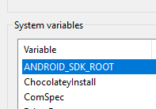

# Prepare Your Setup

You need to :&#x20;

* Install node.js / npm
* Mysql & **PHP 8.2**
* Hosting / server setup (Frontend & Backend Domain at same machine), Using xampp / lampp if using localhost
* Java jdk-8u441
*   Install Android Studio (my case using version 2022.3.1.18), min SDK Android 5.1 target SDK Android 11 to custom your mobile apps

    * Android SDK on Environment Variables (ANDROID\_SDK\_ROOT)

    <figure><figcaption></figcaption></figure>
*   Android Studio with config as below

    <figure><figcaption></figcaption></figure>

    <figure><figcaption></figcaption></figure>
*   Gradle (gradle-7.4.2) and ensure path variable also pointing bin folder on Path entry like below

    <figure><figcaption></figcaption></figure>
